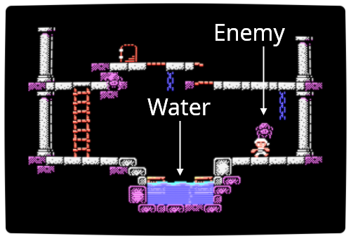
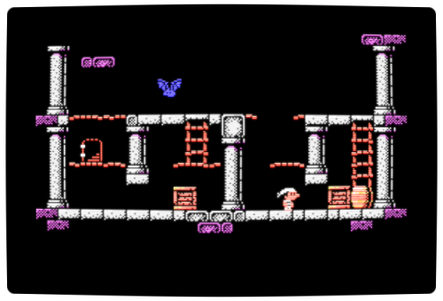

# The story

Stevedore works at the docks, loading and unloading ships in a small coastal town.

He is in love with the beautiful lighthouse keeper.

Today is the annual summer party, and Stevedore is hurrying up to finish the job and go to the party with her.

	Suddenly&hellip; 
	the floor cracks under his feet&hellip;

Help Stevedore find the keys to get out of the abandoned warehouse. The lighthouse keeper is waiting for him at the lighthouse.

	Or isn't she? 
	What other adventures might happen!?

<strong>
	Good luck, Stevedore!</strong>

---
# Preparations

- First make sure your computer and your video monitor are hooked up correctly. Refer to the instruction manual of your computer to make the appropriate connections.

- Make sure your compuer is switched off, then insert the ROM cartridge with the picture side facing you. Make sure that the cartridge is inserted all the way in and makes complete contact.

- Switch on your computer.

- Switch on the TV monitor and tune to the channel which will display the computer-generated image.

- This game can be played with an optional joystick. Connect the lead from the joystick to terminal A before begin to play.

---
# How to play

This game is designed to be played by one person with either the keyboard or a joystick.

Press space key or the trigger on the joystick to start the game.

You control the actions of Stevedore. At the beginning of the game you have five lives.

In order to procees, you must get the key and enter the exit door of each room.

You can get a key by passing directly in front of it. If you get the key, the door to the next room will open.

If an enemy touches Stevedore, if Stevedore walks onto spikes, or if Stevedore falls into the water, you will lose one life.

The game ends when all lives are lost.

If you can no longer proceed in the game as the result of mistakes you have made in play, press the STOP key. This will start you once again at the beginning of the same room in which you stopped. You will lose one life by doing this, however.

---
# Controls & Keys

|*Control*|*Effect*|
|-|-|
|<kbd>&larr;</kbd> <kbd>&rarr;</kbd>|&bull; Walk left or right &bull; Push box left or right (in front of a box)|
|<kbd>&uarr;</kbd> <kbd>&darr;</kbd>|&bull; Go up or down ladders (in front of a ladder) &bull;Enter the exit door (in front of an open door)|
|Space key Trigger A|&bull;Jump|
|<kbd>STOP</kbd> key1 Trigger B held|&bull;Restart the current room &bull;Return to the title screen (when losing one life)|

1 In the digital edition, <kbd>ESC</kbd> and <kbd>RETURN</kbd> keys can be used instead of <kbd>STOP</kbd> key.

 
When played on MSX2, hold the following keys during the game start-up:

|*Key*|*Palette*|
|-|-|
|(none)|&bull; Enhanced palette|
|<kbd>1</kbd>|&bull; Default MSX palette (TMS9918 approximate)|
|<kbd>2</kbd>|&bull; Default MSX2 palette (V9938)|

 
Once you know a password, you can progress directly to the stage following it (even if you have turned off your MSX):

|*Key*|*Effect*|
|-|-|
|<kbd>SELECT</kbd> key2 Trigger B|&bull; Skip tutorial stages (at start-up sreen)|
|<kbd>SELECT</kbd> key2 Trigger B|&bull; Enter password (at title screen)|

2 In the digital edition, <kbd>TAB</kbd> and <kbd>BS</kbd> keys can be used instead of <kbd>SELECT</kbd> key.

---
# Hints

You can get some items by passing directly in front of them:

<table><tr>
	<td></td>
	<td>The keys will unlock the door to the next room.</td>
</tr><tr>
	<td></td>
	<td>Grandma says the fruits are good for the memory (and delicious too!)</td>
</tr><tr>
	<td></td>
	<td>These little stars are quite rare, and nobody knows for sure what they are for.</td>
</tr></table>

 
There are several animals that live around the abandoned warehouse. Each animal has a characteristic type of movement. Figure out as quickly as you can how to avoid them!

<table><tr>
	<td></td>
	<td>The bats simply fly around. Grandma dislikes them for no apparent reason.</td>
</tr><tr>
	<td></td>
	<td>The spiders hide quietly in the dark. But they won't miss any opportunity to bite someone.</td>
</tr><tr>
	<td></td>
	<td>The snakes wander around aimlessly, getting in everyone's way.</td>
</tr><tr>
	<td></td>
	<td>
Jellyfishes are armed with stinging tentacles. Fortunately, they live under water&hellip;</td>
</tr><tr>
	<td></td>
	<td>Sea urchins don't move too much, but can push themselves with their spines. on't get too close to them!
</td>
</tr><tr>
	<td></td>
	<td>Grandma used to tell stories about the beligerant tribe of Pantojos&hellip; but it's been a long time since the last Pantojo was seen ashore in Stevedore's town. Nowadays, nobody remembers where their island is.</td>
</tr></table>

 
And, as grandma says, "think before you act". There is no time limit, so carefully plan your movements in advance. Otherwise, you are likely to get stuck.

---
# Cautions

- Use only with home computers bearing the MSX mark.

- Be sure that your computer is turned off when inserting and removing the cartridge.

- Do not touch slot connections.

- Do not attempt to open or disassemble the cartridge.

- Avoid extreme temperatures, humidity, and impacts.

---

<strong>
	Stevedore 
	&copy; theNestruo & Wonder 2020</strong>

	Concept, code & GFX: theNestruo 
	Music & SFX: Wonder 
	Cover art: Sirelion

